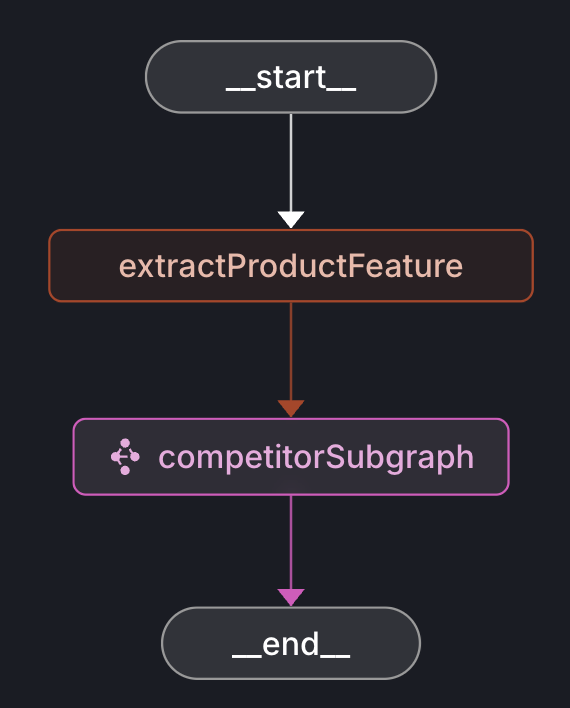
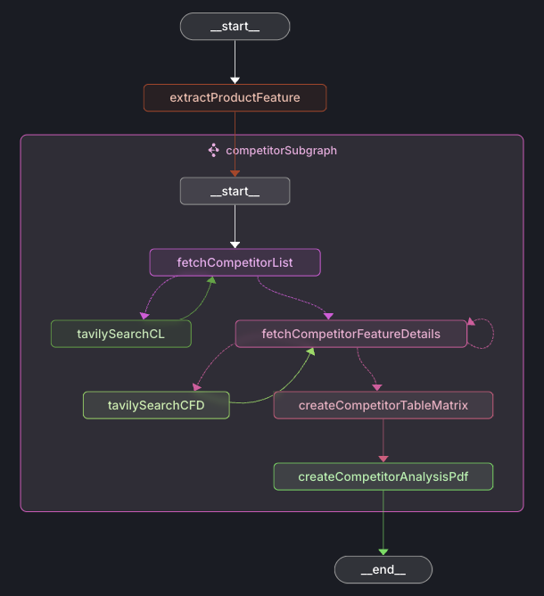
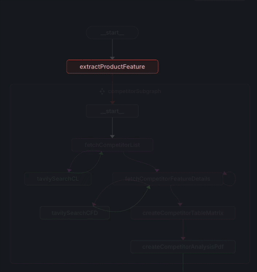
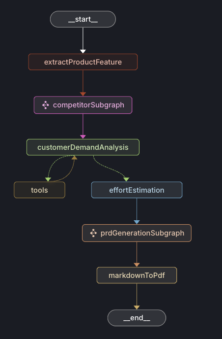
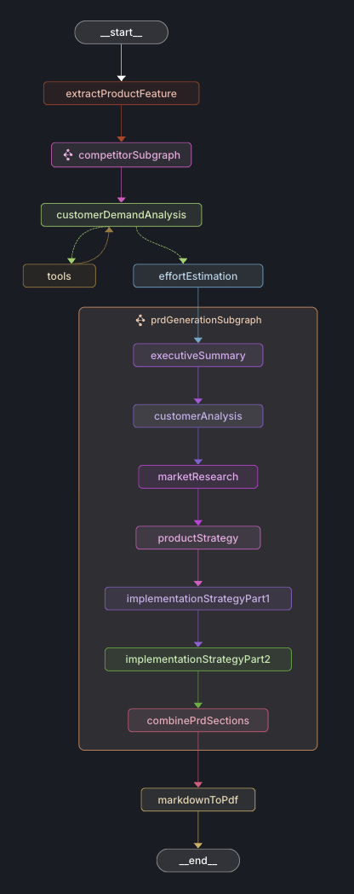
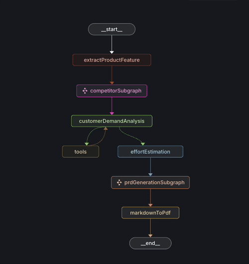
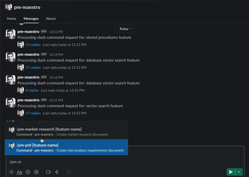
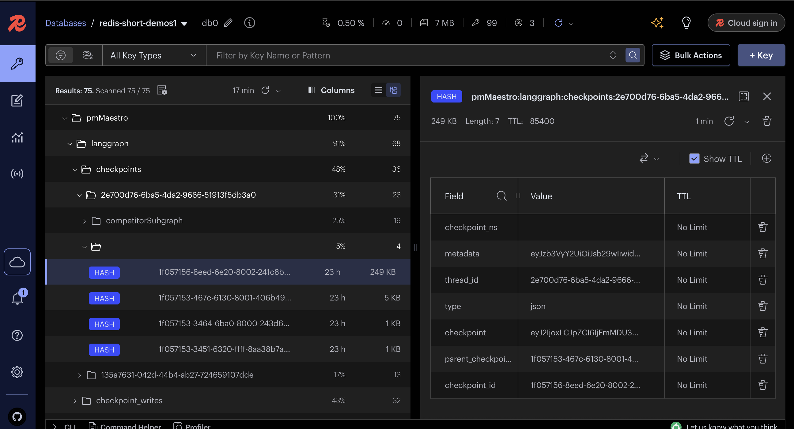
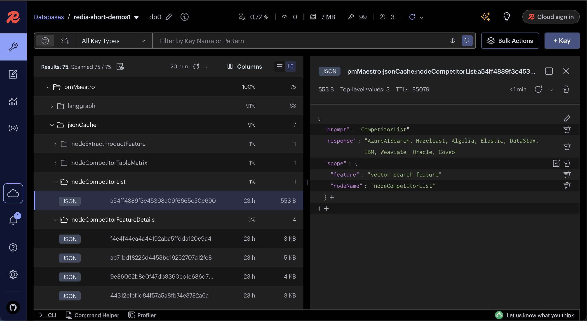

# PM Maestro

PM Maestro is a demonstration AI agent built with [LangGraph JS](https://langchain-ai.github.io/langgraphjs/) to automate common Product Management tasks. It integrates various technologies—including `Redis` as `checkpointers`, `vector databases` and `LLM cache` for the agent's memory, and more—to showcase how developers can build robust AI-driven workflows for real-world use cases.

## Introduction

In modern software development, Product Managers spend a significant amount of time performing repetitive but critical tasks—collecting customer feedback, researching markets, estimating efforts, and drafting product requirements. LangGraph `PM Maestro` is a proof-of-concept agent that demonstrates how you can automate these tasks using an AI agent. This repository also acts as a practical example of how LangGraph integrates with data stores like `Redis` and advanced features (checkpointers, LLM cache, vector DB, etc.) to build reliable, modular AI workflows.

## Tech stack

- Language : TypeScript (NodeJS)
- Framework : [LangGraph JS](https://langchain-ai.github.io/langgraphjs/) for workflow orchestration
- Database : [Redis](https://redis.io/learn) as `checkpointer` and `LLM cache`
- LLM Provider : `OpenAI`
- Search tool : `Tavily` for web search
- (Optional) Slack Bot Integration : To trigger the agent via slack
- (Optional) Salesforce Data Integration : To include search results of the requested feature from Salesforce CRM for better context
- (Optional) Jira Data Integration : To include search results of the requested feature from Jira for better context

## Project setup

### Clone the Repository

```sh
git clone https://github.com/redis-developer/langgraph-pm-maestro.git
cd langgraph-pm-maestro
```

### Install Dependencies

```sh
npm install
```

### Configure Environment Variables

- Copy the example environment file to create your own configuration:

```sh
cp .env.example .env
```

- Main environment variables

```sh title=".env"
# OpenAI API
OPENAI_API_KEY=""
OPENAI_MODEL_NAME="gpt-4o-mini"

# Tavily Search API
TAVILY_API_KEY=""

# Redis
REDIS_URL=""
```

Note :

- To get an OPENAI_API_KEY : Sign up for an [OpenAI account](https://platform.openai.com/signup) and create an API key in the [API keys page](https://platform.openai.com/api-keys)

- To get a TAVILY_API_KEY : You can sign up [here](https://tavily.com/)

### Run the application

```sh
npm run dev
```

- Launches the agent locally and opens the studio interface in your browser at:
  `https://smith.langchain.com/studio?baseUrl=http://localhost:2024` (Test in `chrome` browser)

## Workflows

Below are the main workflows `PM Maestro` agent can perform. These illustrate the broader capabilities of LangGraph-powered agents and can be adapted for other domains or roles:

- `Market research workflow` : It performs (competitor site) web searches for a given product feature and generates a feature matrix comparing different market players in a PDF format.

- `PRD (Product Requirements Document) generation workflow` : It drafts a concise Product Requirements Document (PRD) based on newly gathered market research data and existing systems data (customer demand from JIRA and Salesforce for particular feature). It includes proposed solution (MVP Scope), effort estimation, prioritized requirements, key technical considerations and other PRD template details.

## Market research workflow

Below is the workflow graph for the `Market research workflow`.



Note : `competitorSubgraph` is a subgraph that contains further nodes to fetch the competitor list and feature details.



Let's understand each node in the graph:

- `extractProductFeature` : It extracts the product feature from the user's input. Eg: "Create PRD for stored procedures feature"

```json
// Output
{
  "productFeature": "stored procedures"
}
```

- `fetchCompetitorList` : It fetches the list of competitors for the given product feature using `Tavily` web search.

```json
// Output
{
  "competitorList": ["SQL Server", "Oracle", "MySQL", "PostgreSQL"]
}
```

- `fetchCompetitorFeatureDetails` : It fetches the feature details for the each competitor using `Tavily` web search.

```json
// Output
{
  "competitorFeatureDetailsList": [
    {
      "competitorName": "SQL Server",
      "featureDetails": "Stored procedures in Microsoft SQL Server are a powerful feature that allows users to encapsulate a group of one or more Transact-SQL (T-SQL) statements into a single callable unit..."
    },
    {
      "competitorName": "Oracle",
      "featureDetails": "Oracle Database provides a robust stored procedures feature that allows developers to encapsulate business logic within the database. This feature enhances performance, security, and code reuse, making it a powerful tool for building maintainable database applications...."
    }
  ]
}
```

- `createCompetitorTableMatrix` : It creates a table matrix comparing the feature details of the competitors.

- `createCompetitorAnalysisPdf` : It creates a PDF of the earlier competitorFeatureDetails and competitorTableMatrix.

- 

- Once you run the workflow in langgraph studio, you will see the created file in the `./prd-files` folder with the name `competitor-analysis-<date-time>.pdf`.

Note : You can adjust the prompts in the `src/agent/prompts/` folder according to your needs.

## PRD (Product Requirements Document) generation workflow

Below is the workflow graph for the `PRD (Product Requirements Document) generation workflow`.

- 
- 

Note : `extractProductFeature` and `competitorSubgraph` are the same as in the `Market research workflow`. Let's understand other nodes in the graph:

- `customerDemandAnalysis` : It aggregates customer demand data from multiple systems (JIRA and Salesforce) for the given product feature. It performs tool calls to both systems to fetch the data according to configured queries. There's a separate section the tutorial on how to set up Salesforce and Jira.

- `effortEstimation` : It estimates the effort required (T-shirt sizing) to implement the given product feature based on competitor analysis and (optional) customer demand data.

```json
{
  "tshirtSize": {
    "size": "M",
    "personMonths": 4.5, //over all effort
    "rationale": "Medium complexity with existing infrastructure support"
  },
  "components": [
    // sub tasks effort
    {
      "name": "Backend API",
      "description": "Implement REST endpoints for data processing",
      "effortMonths": 2,
      "customerImpact": "Enables real-time data access for FinTech Solutions",
      "technicalComplexity": "Medium"
    }
    //...
  ]
}
```

- `prdGenerationSubgraph` : It generates different sections of the PRD like executive summary, customer analysis, market research, product strategy, implementation strategy, etc.

- `markdownToPdf` : It converts the generated PRD markdown to a PDF file.

- 

- Once you run the workflow in langgraph studio, you will see the created file in the `./prd-files` folder with the name `mini-prd-<date-time>.pdf`.

Note : You can adjust the prompts in the `src/agent/prompts/` folder according to your needs.

## Salesforce Integration (optional)

Sign up at [salesforce](https://developer.salesforce.com/signup) to get `SF_USERNAME` and `SF_PASSWORD` keys. You can get `SF_SECURITY_TOKEN` from `Settings -> Personal Information -> Reset Security Token`.

Then Set up below environment variables:

```sh
# ==============================================
# SALESFORCE CONFIGURATION
# ==============================================
SF_USERNAME="your login username"
SF_PASSWORD="your login password"
SF_SECURITY_TOKEN="your security token"
SF_LOGIN_URL="https://login.salesforce.com"
# Sample Search Query - SEARCH_FIELD will be automatically replaced with requested feature
SF_SEARCH_FEATURE_QUERY="FIND {SEARCH_FIELD} IN ALL FIELDS RETURNING TechnicalRequest(Id, Name, painPoint, featureRequestDetails, potentialDealSize, industry, priority, currentWorkaround, businessImpact)"
```

Note : Modify the `SF_SEARCH_FEATURE_QUERY` query to suit your Salesforce org and object structure

## Jira Integration (optional)

Sign up for an [Atlassian account](https://id.atlassian.com/signup) and create a JIRA Cloud instance for development.Generate an API token from your Atlassian profile (under Security settings).

Then Set up below environment variables:

```sh
# signed up profile
JIRA_BASE_URL=https://yourdomain.atlassian.net
JIRA_EMAIL=your-email@example.com
JIRA_API_TOKEN=your_api_token
# Sample JQL Query - SEARCH_FIELD will be automatically replaced with requested feature
JIRA_JQL_QUERY="project = 'CPG' AND textfields ~ 'SEARCH_FIELD' ORDER BY created DESC"
```

Note : Modify the `JIRA_JQL_QUERY` query to suit your JIRA project and object structure

## Slack Bot Integration

Follow the steps in [slack.md](https://github.com/redis-developer/langgraph-pm-maestro/blob/main/docs/how-tos/slack.md) to create a slack app and set up integration.

Once you have below environment variables set up based on above steps, you can run the slack bot locally using `npm run slack-bot` and test it in your slack workspace.

```sh title=".env"
SLACK_SIGNING_SECRET="your signing secret"
SLACK_BOT_TOKEN="your bot token"
SLACK_APP_TOKEN="your app token"
SLACK_BOT_PORT=8080
```

```sh
npm run start-slack-bot
# (console output) ⚡️ Slack bot is running and connected!
```

- We have two slash commands in the bot to trigger each workflow:

  - `/pm-market-research` : runs the market research workflow
  - `/pm-prd` : runs the PRD generation workflow

- Go to your slack workspace and send a message to the bot `/pm-market-research stored procedures feature` or `/pm-prd stored procedures feature`

- You will see the output (intermediate messages and final file) in the channel.



## Checkpointer

- Explain short term memory concept, then Redis as checkpointer in langgraph

Below is the screenshot of checkpointer data in [Redis Insight](https://redis.io/insight/)



## Cache (LangCache and JSON cache)

- Explain LLM cache concept (speed + cost savings)
- Tel them next time they run the workflow, they will get the same response from the Redis instead of calling the LLM again

Below is the screenshot of cache data in [Redis Insight](https://redis.io/insight/)



## Conclusion

## Resources

- Official python integrations for [Redis Langgraph checkpointer and store](https://github.com/redis-developer/langgraph-redis)
- [Try Redis Cloud](https://redis.io/try-free/) : To try Redis Cloud for free
- [Redis YouTube channel](https://www.youtube.com/c/Redisinc)
- [Redis Insight](https://redis.io/insight/) : To view your Redis data or to play with raw Redis commands in the workbench
